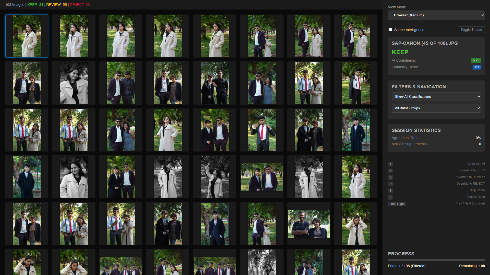
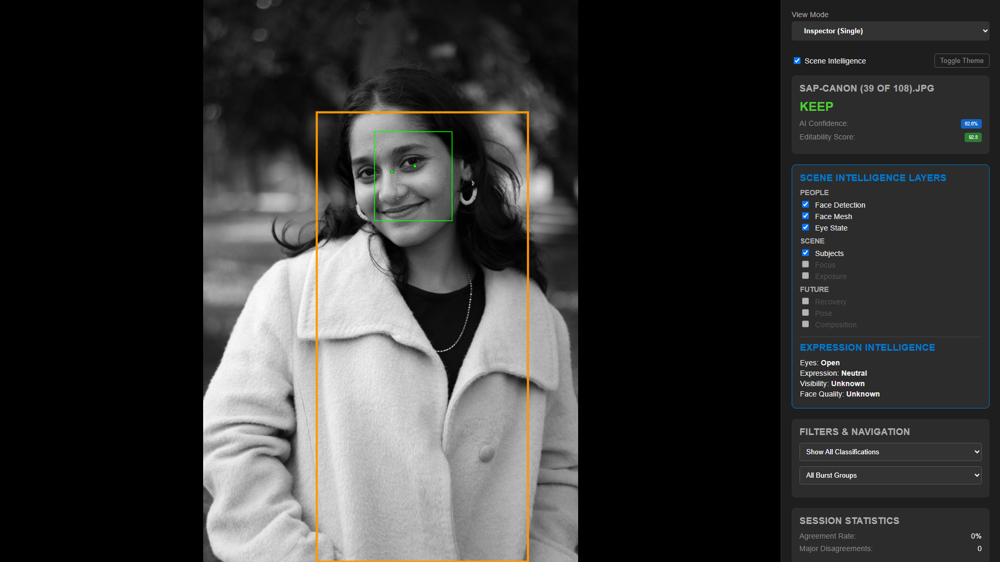
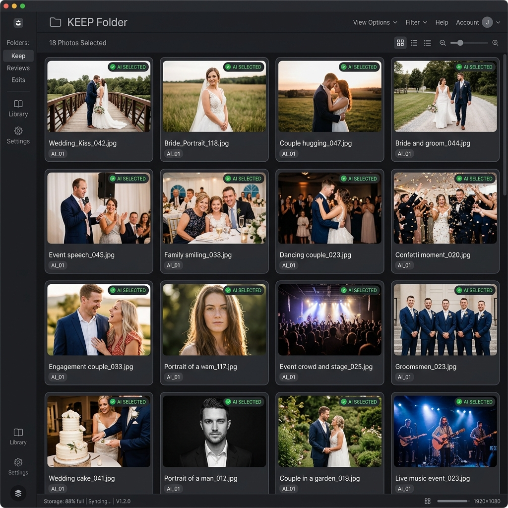
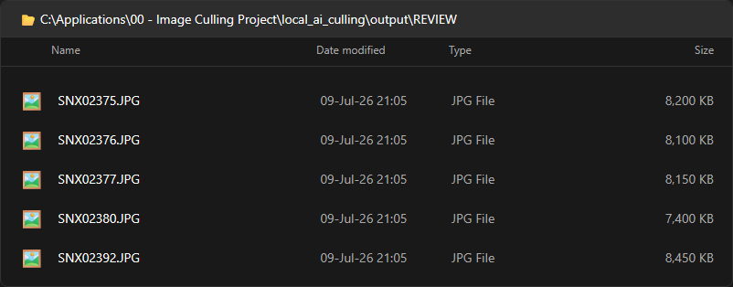
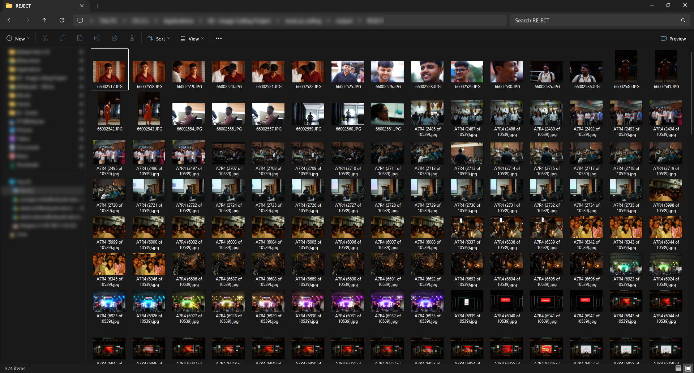
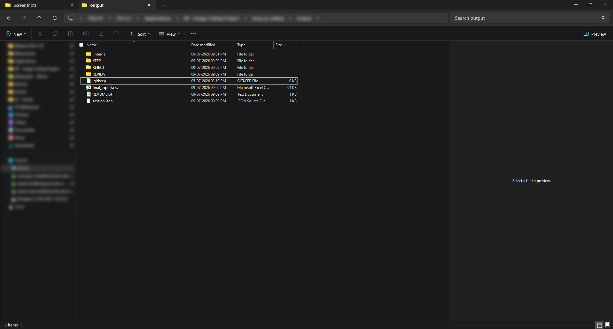
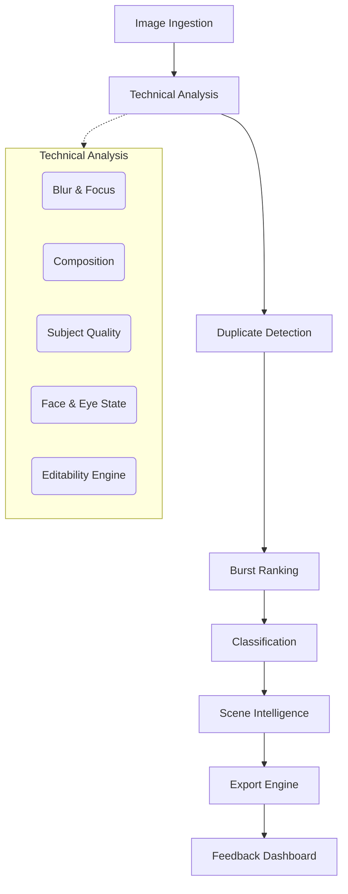

# Local AI Culling

Local AI Culling is a completely offline, privacy-first, AI-assisted image culling tool built specifically for professional photographers. It analyzes your raw photo shoots, groups bursts, detects duplicates, evaluates technical quality (focus, noise, composition, expressions), and automatically organizes your images into `KEEP`, `REVIEW`, and `REJECT` folders so you can immediately begin editing your best work in Adobe Lightroom or your preferred editor.

Because it runs 100% locally on your own hardware, your photographs are never uploaded to the cloud, ensuring total client privacy and eliminating subscription fees.

## Features

- **Duplicate Detection**: Groups visually identical photos taken moments apart.
- **Burst Detection & Ranking**: Identifies high-speed bursts and automatically selects the single best frame.
- **Intelligent Classification**: Sorts images into `KEEP`, `REVIEW`, and `REJECT` based on customizable scoring.
- **Expression Intelligence**: Understands facial semantics (e.g., closed eyes, blinking, awkward mouth shapes) to avoid penalizing artistic choices while flagging ruined shots.
- **Image Editability Engine**: Simulates shadow and highlight recovery on the raw preview to estimate real-world editability (penalizing noise and color degradation).
- **Scene Intelligence**: Detects environmental and subject context (e.g., weddings, portraits, low-light).
- **Photographer Feedback Dashboard**: A local web interface to review decisions, adjust thresholds, and understand exactly *why* the AI made a decision.
- **Hardlink Export Engine**: Instantly creates organized output folders using zero-byte storage hardlinks. The original files are never duplicated or modified.
- **Explainable Decisions**: Transparent scoring. No black-box AI magic—you can see exactly why a photo was rejected.

## Screenshot Gallery

### Dashboard Overview (Browser Mode)


### Scene Intelligence (Inspector Mode)


### KEEP Folder View


### REVIEW Folder View


### REJECT Folder View


### Hardlinked Export Structure

```text
output/
├── KEEP/
├── REVIEW/
├── REJECT/
├── final_export.csv
└── session.json
```

---

## Architecture

Local AI Culling operates as a highly modular pipeline. 



### Session Management
The dashboard includes an automated Session Management engine. When the pipeline processes a new directory, it generates a deterministic `session.json` based on the dataset name and filenames. When the feedback dashboard launches, it compares this session against previous feedback files. If it detects a new photography assignment, it safely archives the older feedback to prevent data collisions, ensuring that photographers can seamlessly review multiple consecutive shoots without manual cleanup.

## Installation

### Prerequisites
- **Python**: 3.10 or higher.
- **Storage**: SSD highly recommended for fast preview reading.

### Setup
1. **Clone the repository:**
   ```bash
   git clone https://github.com/yourusername/local_ai_culling.git
   cd local_ai_culling
   ```

2. **Create a virtual environment:**
   ```bash
   python -m venv .venv
   .venv\Scripts\activate  # Windows
   # source .venv/bin/activate  # Mac/Linux
   ```

3. **Install dependencies:**
   ```bash
   pip install -r requirements.txt
   ```

4. **Model Placement:**
   Ensure the following models are placed in the `models/` directory:
   - `yolov8n.pt` (Ultralytics YOLOv8)
   - `face_landmarker.task` (MediaPipe FaceLandmarker)

## Usage

### 1. Running the Pipeline
Run the culling engine on a folder of photographs:

```bash
python main.py -i path/to/your/photos -o output
```
This will analyze the photos and create the final `KEEP`, `REVIEW`, and `REJECT` folders via hardlinks.

### 2. Launching the Dashboard
To review the results visually:

```bash
python run_dashboard.py
```
Open your browser to `http://localhost:5000`.

---

## Project Structure

- `src/culler/ai/`: Core AI and scoring models (blur, composition, face/eye, editability, duplicate detection).
- `src/culler/engine/`: System engine (pipeline orchestration, configuration loading, caching).
- `src/culler/engine/io/`: File ingestion, JSON/CSV exports, visual export, and preview generation.
- `src/culler/engine/analysis/`: Profiling and metadata utilities.
- `src/culler/dashboard/`: Local web dashboard interface (`feedback_server.py`) and HTML templates.
- `tests/`: Smoke tests and module linkage tests.
- `docs/`: System documentation, phase plans, and architectural walk-throughs.
- `models/`: Directory for required machine learning weights (`.pt`, `.task`).
- `output/`: Default directory for hardlinked output and runtime metadata.

---

## Configuration

The software is highly customizable via `config.yml`. Key configurable options include:
- **`thresholds`**: Adjust the strictness for blur, noise, and face quality.
- **`weights`**: Adjust how much different factors (e.g., composition vs focus) contribute to the final score.
- **`export.mode`**: Choose between `hardlink` (default, zero extra storage) or `copy`.
- **`culling.max_burst_time_gap`**: The maximum time gap (in seconds) to consider photos part of the same burst.

---

## Documentation

For a deeper dive into the engineering and design philosophy behind Local AI Culling, see:
- [Implementation Walkthrough](docs/phases/Walkthrough.md)
- [Architecture Proposal](docs/architecture/Architecture.md)
- [Validation Reports](docs/research/Validation_Report.md)

---

## Roadmap

Check out the [ROADMAP.md](ROADMAP.md) for a summary of completed milestones (like Expression Intelligence and the Editability Engine) and a look at our future goals.

## License

This project is licensed under the MIT License - see the [LICENSE](LICENSE) file for details.
