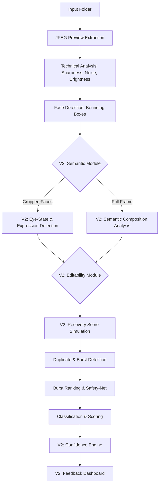

# Version 2 Architecture Proposal

This document outlines the architectural blueprint for Version 2. The primary goal is to integrate semantic understanding, editability metrics, and confidence scaling without introducing technical debt or compromising the local, offline, lightweight nature of the application.

---

## Version Milestones

* **Version 1.0** — Technical Culling Engine
* **Version 1.1** — Feedback Dashboard
* **Version 1.2** — Confidence Engine
* **Version 2.0** — Scene Intelligence
* **Version 2.1** — Eye-State Detection
* **Version 2.2** — Recovery Score
* **Version 2.3** — Semantic Composition

---

## 1. Pipeline Review & Integration Points

To maintain scalability, new modules must be inserted at specific, logical points rather than bolted onto the end. The proposed V2 pipeline is linear but hierarchical, meaning expensive modules only run when necessary.

**Key Integration Rules:**
*   **Semantic Modules (Expressions/Composition)** must execute *after* basic face detection so they can re-use the calculated bounding boxes.
*   **Recovery Score** must execute *before* Burst Detection, because an image with terrible recovery should lose its rank in a burst group.
*   **Confidence Engine** must be the final analytical step, as it requires the sum of all penalties and the burst rank to calculate probability.

---

## 2. Candidate Modules Evaluation

### Module 1: Eye-State & Expression Detection
*   **Purpose:** To eliminate the ~18% of False Positives caused by subjects blinking or making awkward expressions.
*   **Architecture:** Do *not* run a full-frame scan. Instead, pass the bounding boxes generated by the existing `retinaface` module into a lightweight facial landmark detector (e.g., Google MediaPipe Face Mesh).
*   **Inputs:** Cropped face image arrays.
*   **Outputs:** Penalty scores for `eye_closure`, `mouth_awkwardness`.
*   **Hardware Profile:** Extremely lightweight on CPU. `< 15ms` per cropped face.
*   **Expected Accuracy Impact:** High. Solves the most frustrating False Positives.

### Module 2: Recovery / Editability Score
*   **Purpose:** To detect "hidden" noise and predict if an underexposed JPEG will fall apart when shadows are lifted in RAW editing.
*   **Architecture:** Vectorized OpenCV operations. Apply a non-linear gamma curve (simulating +2.0 EV / +100 Shadows) to a shadow mask, then measure local Laplacian variance and Chroma variance (`CrCb`).
*   **Inputs:** Full-frame 1080p preview.
*   **Outputs:** `recovery_penalty` float.
*   **Hardware Profile:** Very fast on CPU using AVX2. `< 20ms` per image.
*   **Expected Accuracy Impact:** Very High. Addresses the massive 46% "Other" and 9% "Exposure" disagreement categories.

### Module 3: Semantic Composition Analysis
*   **Purpose:** To detect photobombs, foreground obstructions (microphone stands), and awkward edge-cropping.
*   **Architecture:** Requires a lightweight semantic segmentation or depth-estimation model (e.g., YOLOv8-nano or MiDaS-small).
*   **Inputs:** Full-frame preview (downscaled to 640x640 for speed).
*   **Outputs:** `composition_penalty`.
*   **Hardware Profile:** Medium-to-Heavy. Will require the RTX 3050 GPU. `< 100ms` per image if batched, but highly variable.
*   **Expected Accuracy Impact:** Medium. Solves ~15% of disagreements, but risks high computational overhead.

---

## 3. Confidence Engine Design

Currently, the classifier is a hard boolean threshold (`KEEP >= 60.0`). The Confidence Engine will transform this into a probability curve.

**Methodology:**
We will use a **Logistic Sigmoid Function** wrapped around the distance from the threshold. 

*   `Score = 60` ➔ `Confidence = 50%` (Borderline)
*   `Score = 80` ➔ `Confidence = 90%` (Definite KEEP)
*   `Score = 40` ➔ `Confidence = 85%` (Definite REJECT)

**Calibration Strategy:**
1.  Calculate distance from the closest threshold boundary (60.0 for KEEP, 40.0 for REJECT).
2.  If the image was mathematically "saved" by the Burst Safety-Net, automatically cap confidence at `55%` (it is inherently uncertain).
3.  Output as a strict integer percentage (`0% - 100%`).

---

## 4. Dashboard UX Improvements

The dashboard will be updated purely visually to support the new metadata without altering core workflows.

1.  **AI Confidence Badge:** Displayed next to the classification (e.g., `KEEP (92%)`).
2.  **Telemetry Data:** Display estimated remaining time based on rolling average processing speed.
3.  **Filtration:** Add keyboard toggles to filter the view:
    *   `F1`: Show All
    *   `F2`: Show only Disagreements (for reviewing past sessions)
    *   `F3`: Show only Low Confidence (<60%) images
4.  **Dark/Light Theme:** Optional CSS toggle for bright room editing.

---

## 5. Performance Budget & Resource Usage

Hardware Target: **Ryzen 7 4800H | RTX 3050 (4GB VRAM) | 16GB RAM**

**Optimization Recommendation:**
To maintain a fast workflow, we must use a **Tiered Execution Strategy**:
> [!IMPORTANT]
> **Semantic Composition Analysis (YOLO/MiDaS)** is too heavy to run on 5,000 images. It should ONLY be executed on images that have already passed the baseline Technical Analysis and are classified as `KEEP` or `REVIEW` candidates. `REJECT` garbage (totally black/blurred photos) should short-circuit the pipeline early and skip heavy neural networks.

**Estimated Per-Image Overhead (with short-circuiting):**
*   Baseline IO & Tech Analysis: `~100ms`
*   MediaPipe (Faces): `~30ms`
*   Recovery Score (OpenCV): `~20ms`
*   Semantic Comp (YOLO/GPU): `~80ms` (Only on top 30% of photos)
*   **Weighted Average per image:** `~180ms`

**Total Processing Time Estimates:**
*   **500 images:** ~90 seconds (1.5 minutes)
*   **1000 images:** ~3 minutes
*   **5000 images:** ~15 minutes

This budget is highly practical for a local, offline photography workflow.

---

## 6. Engineering Constraints & Scalability

To ensure the pipeline remains flexible and transparent:

1. **Independent Configurability:** Every module will be strictly toggleable via a central YAML configuration file (e.g., `confidence_engine: true`, `eye_state: true`, `semantic_composition: false`). This allows seamless A/B testing and performance benchmarking without touching Python code.
2. **Transparent Output:** Every analytical module must append its raw scalar score to the CSV outputs (`eye_state_score`, `recovery_score`, `confidence_score`). The system must not hide the "why" behind a final classification.
3. **Continuous Benchmarking:** At the conclusion of each module's implementation, a structured performance benchmark will be run to log execution time, CPU load, and GPU/VRAM utilization.

---

## 7. Implementation Order & Recommendations

Based on user feedback, development will proceed in the following prioritized sequence:

1.  **Phase 6A: Confidence Engine & Dashboard UX**
    *   *Why:* Immediately improves transparency and user trust. Creates the mathematical container and visual UI needed to observe the effects of all subsequent modules.
2.  **Phase 6B: Eye-State & Expression Detection (MediaPipe)**
    *   *Why:* Directly addresses the most frustrating false positives (e.g., perfectly sharp photos of blinking subjects) that accounted for ~18% of validation disagreements.
3.  **Phase 6C: Recovery / Editability Engine**
    *   *Why:* Tackles the hidden "Other" gap between measured noise and real-world editability. Pure OpenCV mathematics, computationally cheap.
4.  **Phase 6D: Semantic Composition (YOLO/MiDaS)**
    *   *Why:* Lowest priority. Carries the highest risk of blowing out the performance budget and VRAM limits. Requires heavy GPU utilization and should only run strictly on filtered subsets.
